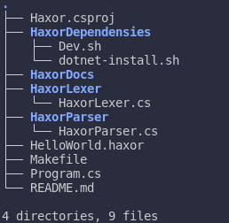

# OMOS
Project Tree: <br />
 <br />
<div id="top"></div>

<details>
  <summary>Table of Contents</summary>
  <ol>
    <li>
      <a href="#about-the-project">About The Project</a>
      <ul>
        <li><a href="#built-with">Built With</a></li>
      </ul>
    </li>
    <li>
      <a href="#Features">Getting Started</a>
      <ul>
        <li><a href="#prerequisites">Prerequisites</a></li>
      </ul>
    </li>
  </ol>
</details>

<!-- ABOUT THE PROJECT -->
## About The Project
Designing and writing my first Language in order to learn Compilers. I dedicate my spare-time to developing this.

### Built With
* [C#](https://docs.microsoft.com/en-us/dotnet/csharp/)
* [MakeFile](https://makefile.site/)

## Features
I will update this part as I go on with the project.

### Prerequisites
I recommend you run the following the scripts and compile bochs from source with the given commands if you're on Linux:
* Prerequisites
  ```sh
  ./Dev.sh
  ```
* Prerequisites
  ```sh
  ./DotnetInstall.sh
  ```